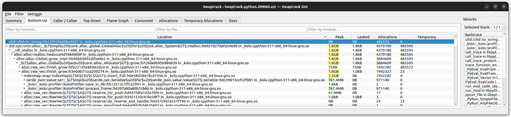
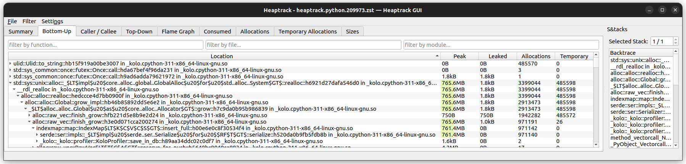
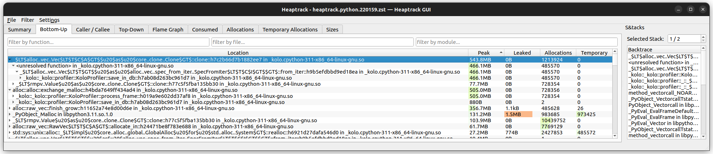
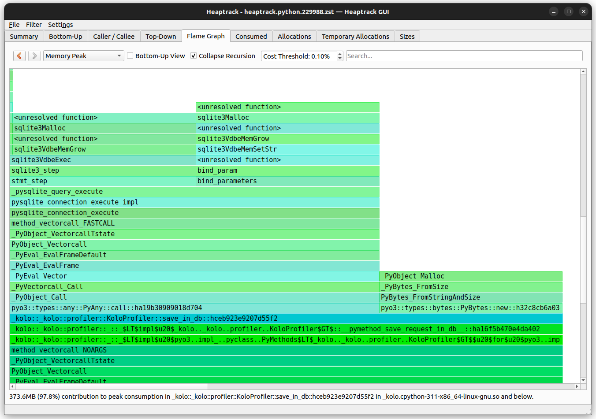

+++
title = "How we reduced the memory usage of our Rust extension by 4x"
date = 2023-10-09
draft = false
categories = ["Rust"]
tags = ["kolo", "rust", "memory", "json", "msgpack", "valgrind", "heaptrack", "pyo3"]
+++

This post was originally [published on the Kolo Blog](https://blog.kolo.app/optimising-rust-memory.html) and has been republished here with thanks to Wil Klopp.

## What is Kolo?

[Kolo](https://kolo.app) is a dynamic code analysis tool for Python. We use [Python's `sys.setprofile`](https://docs.python.org/3/library/sys.html#sys.setprofile) to introspect Python's call stack and local variables. For performance reasons, Kolo is partially implemented in Rust using [the excellent PyO3 crate](https://pyo3.rs/).

## The bug report

Recently, we received a report of Kolo running out of memory when analysing an unusually large Django view. To get an idea of what was causing it, I created a very simple python script that would generate a lot of python frames:


```python
from kolo import enable


def fib(n):
  if n == 0:
    return 0
  if n == 1:
    return 1
  return fib(n - 1) + fib(n - 2)


def profile_fibonnaci(n):
  with enable({"use_rust":True}):
    print(fib(n))


if __name__ == "__main__":
  import sys

  n = int(sys.argv[1])
  profile_fibonnaci(n)
```


```python
from kolo import enable


def fibonnaci(n):
    if n == 0:
        return 0
    if n == 1:
        return 1
    return fibonnaci(n - 1) + fibonnaci(n - 2)


def profile_fibonnaci(n):
    with enable({"use_rust": True}):
        print(fibonnaci(n))


if __name__ == "__main__":
    import sys

    n = int(sys.argv[1])
    profile_fibonnaci(n)
```


By scaling up which fibonacci number to calculate, I was able to observe very high memory usage in the Rust extension. After confirming that the reporter also only saw the issue when `use_rust` was set to `True`, I dug in.

## Valgrind

To understand the memory usage I first turned to valgrind, as recommended by [the pyo3 documentation](https://pyo3.rs/v0.19.2/debugging#running-with-valgrind). I downloaded a [suppressions file for Python](https://github.com/python/cpython/blob/dd4bb0529e44ac6f75a9ebbfcbf5d73dc251b7a7/Misc/valgrind-python.supp) and tried running my test script:


```
$ valgrind \
  --suppressions=\
  valgrind-python.supp \
  python big_trace.py 15
==196497== Memcheck, a memory
    error detector
==196497== Copyright (C)
    2002-2017, and GNU GPL'd,
    by Julian Seward et al.
==196497== Using Valgrind-3.18.1
    and LibVEX; rerun with -h
    for copyright info
==196497== Command:
    python big_trace.py 15
==196497==
610
==196497==
==196497== HEAP SUMMARY:
==196497==     in use at exit:
    12,390,108 bytes
    in 122,153 blocks
==196497==   total heap usage:
    471,170 allocs,
    349,017 frees,
    106,233,282 bytes allocated
==196497==
==196497== LEAK SUMMARY:
==196497==    definitely lost:
    24 bytes in 1 blocks
==196497==    indirectly lost:
    0 bytes in 0 blocks
==196497==      possibly lost:
    940,514 bytes in
    9,878 blocks
==196497==    still reachable:
    11,449,570 bytes in
    112,274 blocks
==196497==         suppressed:
    0 bytes in 0 blocks
==196497== Rerun with
    --leak-check=full to see
    details of leaked memory
==196497==
==196497== For lists of detected
    and suppressed errors, rerun
    with: -s
==196497== ERROR SUMMARY:
    0 errors from 0 contexts
    (suppressed: 0 from 0)
```


```
$ valgrind --suppressions=valgrind-python.supp python big_trace.py 15
==196497== Memcheck, a memory error detector
==196497== Copyright (C) 2002-2017, and GNU GPL'd, by Julian Seward et al.
==196497== Using Valgrind-3.18.1 and LibVEX; rerun with -h for copyright info
==196497== Command: python big_trace.py 15
==196497==
610
==196497==
==196497== HEAP SUMMARY:
==196497==     in use at exit: 12,390,108 bytes in 122,153 blocks
==196497==   total heap usage: 471,170 allocs, 349,017 frees, 106,233,282 bytes
             allocated
==196497==
==196497== LEAK SUMMARY:
==196497==    definitely lost: 24 bytes in 1 blocks
==196497==    indirectly lost: 0 bytes in 0 blocks
==196497==      possibly lost: 940,514 bytes in 9,878 blocks
==196497==    still reachable: 11,449,570 bytes in 112,274 blocks
==196497==         suppressed: 0 bytes in 0 blocks
==196497== Rerun with --leak-check=full to see details of leaked memory
==196497==
==196497== For lists of detected and suppressed errors, rerun with: -s
==196497== ERROR SUMMARY: 0 errors from 0 contexts (suppressed: 0 from 0)
```


Unfortunately I didn't find the output easy to understand at first. After more reading and running with different configurations, I realised that I didn't have a memory leak per se. Instead I was using a lot of memory, which was then cleaned up properly when no longer needed. Specifically, although there is maybe a 12MB leak ("in use at exit"), this is just a fraction of the total 106MB allocated ("total heap usage").

## Heaptrack

I next turned to the [`heaptrack` memory profiler](https://github.com/KDE/heaptrack), and this was much more useful.


```
$ sudo apt install heaptrack \
  heaptrack-gui

$ heaptrack python \
    big_trace.py 25
```


```
$ sudo apt install heaptrack heaptrack-gui

$ heaptrack python big_trace.py 25
```



As can be seen, about 60% of the memory is being used in `_kolo::_kolo::profiler::KoloProfiler::save_in_db` and the other 40% in `_kolo::_kolo::profiler::KoloProfiler::process_frame`.

Lets first look at a simplified version of `save_in_db`:


```rust
fn save_in_db(&self, py: Python)
    -> Result<(), PyErr> {
  // prepare other data to save

  let mut state = self
    .frames_of_interest
    .lock().unwrap();
  let frames_of_interest =
    std::mem::take(&mut *state);

  let data = json!({
    "frames_of_interest":
      frames_of_interest,
  });
  let db = PyModule::import(
    py, "kolo.db")?;
  let save = db.getattr(
    intern!(py,
     "save_invocation_in_sqlite"
    ))?;
  save.call1((&self.db_path,
    data.to_string()))?;
  Ok(())
}
```


```rust
    fn save_in_db(&self, py: Python) -> Result<(), PyErr> {
        // prepare other data to save

        let mut state = self.frames_of_interest.lock().unwrap();
        let frames_of_interest = std::mem::take(&mut *state);

        let data = json!({
            "frames_of_interest": frames_of_interest,
        });
        let db = PyModule::import(py, "kolo.db")?;
        let save = db.getattr(intern!(py, "save_invocation_in_sqlite"))?;
        save.call1((&self.db_path, data.to_string()))?;
        Ok(())
    }
```


`frames_of_interest` is a `Vec<serde_json::Value>`, which we convert into a string then call back into Python to save it to Kolo's sqlite3 database.

Looking at `process_frame`, we see the other side of the process, where we create the `serde_json::Value` items and push them into `self.frames_of_interest`:


```rust
fn process_frame(
  &self,
  frame: PyObject,
  event: &str,
  arg: PyObject,
  py: Python,
) -> Result<(), PyErr> {
  // omitted getting data from
  // various sources

  let frame_data = json!({
    "path": path,
    "co_name": name,
    "qualname": qualname,
    "event": event,
    "frame_id": self._frame_ids
      .get_or_default()
      .borrow()
      .get(&pyframe_id)
      .cloned(),
    "arg": utils::dump_json(
      py, arg)?,
    "locals": json_locals,
    "thread": thread_name,
    "thread_native_id":
      native_id,
    "timestamp":
      utils::timestamp(),
    "type": "frame",
    "user_code_call_site":
      user_code_call_site,
  });

  self.push_frame_data(
    py, frame_data)
}
```


```rust
    fn process_frame(
        &self,
        frame: PyObject,
        event: &str,
        arg: PyObject,
        py: Python,
    ) -> Result<(), PyErr> {
        // omitted getting data from various sources

        let frame_data = json!({
            "path": path,
            "co_name": name,
            "qualname": qualname,
            "event": event,
            "frame_id": self._frame_ids.get_or_default()
                .borrow().get(&pyframe_id).cloned(),
            "arg": utils::dump_json(py, arg)?,
            "locals": json_locals,
            "thread": thread_name,
            "thread_native_id": native_id,
            "timestamp": utils::timestamp(),
            "type": "frame",
            "user_code_call_site": user_code_call_site,
        });

        self.push_frame_data(py, frame_data)
    }
```


## Ijson

Having realised that we were spending a lot of memory storing `serde_json::Value`, I looked into the [ijson crate](https://docs.rs/ijson/latest/ijson/) which aims to optimise the memory usage of json.

By changing each usage of `serde_json::Value` to `ijson::IValue` and the `json!` macro to the `ijson!` macro, I was indeed able to cut the Rust memory usage in half. Before we were using 1.6GB (for `fibonacci(25)`):



With `ijson`, we use 765MB:



This was a really nice win! Unfortunately, our test suite failed when trying to serialize an arbitrary sized integer. Both Python's `json` and Rust's `serde_json` support this. In `serde_json`'s case this requires the `arbitrary_precision` feature), which [is incompatible with ijson](https://github.com/Diggsey/ijson/issues/20).

## Rethinking things

Faced with a choice between dropping compatibility for a supported data type or not improving the memory situation, I decided to take a step back. In Kolo we use json because it's a simple format which is widely supported. However, it has a number of drawbacks which are starting to hurt:

* As a text-based format it's not especially compact.
* It only has support for a limited number of types, which don't match Python's data types amazingly well.

Maybe it was time to try a different format. In particular, [msgpack](https://msgpack.org/index.html) was looking attractive:

* It is a binary format which optimises for size.
* It supports many of the basic types we want to support.
* It has an extension mechanism we can use to implement the missing bits of Python's data model we care about.

After implementing a proof of concept in the Python side of Kolo, it was time to see how it fared in Rust:


```rust
fn save_in_db(&self, py: Python)
    -> Result<(), PyErr> {
  let mut state = self
    .frames_of_interest
    .lock().unwrap();
  let frames_of_interest =
    std::mem::take(&mut *state);

  let data = if self.use_msgpack
    {
    let frames_of_interest:
      Vec<rmpv::Value> =
        frames_of_interest
        .iter()
        .map(|s| match s {
          SerializedFrame::
            Msgpack(v)
            => v.clone(),
          _ => {
            unreachable!(
             "frames_of_interest
             was not all
             msgpack")
          }
        })
        .collect();
    };
    let data = rmpv::Value::Map(
     vec![
      (
       "frames_of_interest"
        .into(),
       frames_of_interest
        .into(),
      ),
    ]);

    let mut buf: Vec<u8> =
      vec![];
    rmpv::encode::write_value(
      &mut buf, &data).unwrap();
    PyBytes::new(py, &buf)
      .into()
  } else {
    // handle json
  };

  let db = PyModule::import(
    py, "kolo.db")?;
  let save = db.getattr(
    intern!(py,
    "save_invocation_in_sqlite"
  ))?;
  save.call1(
    (&self.db_path, data))?;
  Ok(())
}

fn process_frame(
  &self,
  frame: PyObject,
  event: &str,
  arg: PyObject,
  py: Python,
) -> Result<(), PyErr> {
  // omitted getting data from
  // various sources

  let data =
      if self.use_msgpack {
    let frame_data =
      rmpv::Value::Map(vec![
        ("path".into(),
          path.into()),
        ("co_name".into(),
          name.into()),
        ("qualname".into(),
          qualname),
        ("event".into(),
          event.into()),
        ("frame_id".into(),
          frame_id),
        ("arg".into(), arg),
        ("locals".into(),
          locals),
        ("thread".into(),
          thread_name.into()),
        ("thread_native_id"
          .into(),
          native_id.into()),
        ("timestamp".into(),
          utils::timestamp()
          .into()),
        ("type".into(),
          "frame".into()),
        ("user_code_call_site"
          .into(),
          user_code_call_site),
    ]);
    SerializedFrame::Msgpack(
      frame_data)
  } else {
    // handle json
  };

  self.push_frame_data(py, data)
}
```


```rust
    fn save_in_db(&self, py: Python) -> Result<(), PyErr> {
        let mut state = self.frames_of_interest.lock().unwrap();
        let frames_of_interest = std::mem::take(&mut *state);

        let data = if self.use_msgpack {
            let frames_of_interest: Vec<rmpv::Value> = frames_of_interest
                .iter()
                .map(|s| match s {
                    SerializedFrame::Msgpack(v) => v.clone(),
                    _ => {
                        unreachable!("frames_of_interest was not all msgpack")
                    }
                })
                .collect();
            };
            let data = rmpv::Value::Map(vec![
                ("frames_of_interest".into(), frames_of_interest.into()),
            ]);

            let mut buf: Vec<u8> = vec![];
            rmpv::encode::write_value(&mut buf, &data).unwrap();
            PyBytes::new(py, &buf).into()
        } else {
            // handle json
        };

        let db = PyModule::import(py, "kolo.db")?;
        let save = db.getattr(intern!(py, "save_invocation_in_sqlite"))?;
        save.call1((&self.db_path, data))?;
        Ok(())
    }

    fn process_frame(
        &self,
        frame: PyObject,
        event: &str,
        arg: PyObject,
        py: Python,
    ) -> Result<(), PyErr> {
        // omitted getting data from various sources

        let data = if self.use_msgpack {
            let frame_data = rmpv::Value::Map(vec![
                ("path".into(), path.into()),
                ("co_name".into(), name.into()),
                ("qualname".into(), qualname),
                ("event".into(), event.into()),
                ("frame_id".into(), frame_id),
                ("arg".into(), arg),
                ("locals".into(), locals),
                ("thread".into(), thread_name.into()),
                ("thread_native_id".into(), native_id.into()),
                ("timestamp".into(), utils::timestamp().into()),
                ("type".into(), "frame".into()),
                ("user_code_call_site".into(), user_code_call_site),
            ]);
            SerializedFrame::Msgpack(frame_data)
        } else {
            // handle json
        };

        self.push_frame_data(py, data)
    }
```


Here we use the `rmpv` crate, which provides a `Value` similar to `serde_json`'s. Unfortunately it doesn't have an equivalent for the `json!` macro, so we use the more verbose `rmpv::Value::Map` interface, which involves a lot of `.into()` calls to massage the data.

I also introduced the `SerializedFrame` enum allowing us to support both formats for a while.

This worked, but we're still using a lot of memory:



The call to `.clone()` when unpacking the `frames_of_interest` is suspicious:


```rust
let frames_of_interest:
    Vec<rmpv::Value> =
  frames_of_interest
  .iter()
  .map(|s| match s {
    SerializedFrame::Msgpack(v)
      => v.clone(),  // Sus!
    _ => {
      unreachable!(
        "frames_of_interest was
        not all msgpack")
    }
  })
  .collect();
};
```


```rust
            let frames_of_interest: Vec<rmpv::Value> = frames_of_interest
                .iter()
                .map(|s| match s {
                    SerializedFrame::Msgpack(v) => v.clone(),  // Suspicious!
                    _ => {
                        unreachable!("frames_of_interest was not all msgpack")
                    }
                })
                .collect();
            };
```


We're taking each `rmpv::Value` from `frames_of_interest` and copying it! No wonder we're using so much memory. Let's try using `rmpv::ValueRef` instead. This works with a reference to the data, instead of owning the value:


```rust
let frames_of_interest:
    Vec<rmpv::ValueRef> =
  frames_of_interest
  .iter()
  .map(|s| match s {
    SerializedFrame::Msgpack(v)
      => utils::
        load_py_msgpack(v),
    _ => {
      unreachable!(
        "frames_of_interest was
        not all msgpack")
    }
  })
  .collect::<Result<Vec<
    rmpv::ValueRef>, PyErr>>()?;
```


```rust
            let frames_of_interest: Vec<rmpv::ValueRef> = frames_of_interest
                .iter()
                .map(|s| match s {
                    SerializedFrame::Msgpack(v) => utils::load_py_msgpack(v),
                    _ => {
                        unreachable!("frames_of_interest was not all msgpack")
                    }
                })
                .collect::<Result<Vec<rmpv::ValueRef>, PyErr>>()?;
```


To make this work we also update `process_frame` and add `load_py_msgpack`:


```rust
fn process_frame(
  &self,
  frame: PyObject,
  event: &str,
  arg: PyObject,
  py: Python,
) -> Result<(), PyErr> {
  let data =
      if self.use_msgpack {
    let frame_data =
      rmpv::ValueRef::Map(vec![
        ("path".into(),
          path.as_ref()),
        ("co_name".into(),
          name.as_ref()),
        ("qualname".into(),
          qualname.as_ref()),
        ("event".into(),
          event.into()),
        ("frame_id".into(),
          frame_id.as_ref()),
        ("arg".into(), arg),
        ("locals".into(),
          locals),
        ("thread".into(),
          thread_name.into()),
        ("thread_native_id"
          .into(),
          native_id.into()),
        ("timestamp".into(),
          utils::timestamp()
          .into()),
        ("type".into(),
          "frame".into()),
        ("user_code_call_site"
          .into(),
          user_code_call_site
          .as_ref()),
      ]);
    let mut buf: Vec<u8> =
      vec![];
    rmpv::encode::
      write_value_ref(
        &mut buf,
        &frame_data,
    ).unwrap();
    SerializedFrame::Msgpack(
      buf)
  } else {
    // json
  };

  self.push_frame_data(py, data)
}

pub fn load_py_msgpack(
    raw_data: &[u8])
    -> Result<
      rmpv::ValueRef, PyErr
    > {
  let mut data =
    std::io::Cursor::new(
      raw_data);
  let data = match rmpv::
      decode::value_ref::
      read_value_ref(
        &mut data) {
    Ok(value) => value,
    Err(err) => {
      // Error handling
    }
  };
  Ok(data)
}
```


```rust
    fn process_frame(
        &self,
        frame: PyObject,
        event: &str,
        arg: PyObject,
        py: Python,
    ) -> Result<(), PyErr> {
        let data = if self.use_msgpack {
            let frame_data = rmpv::ValueRef::Map(vec![
                ("path".into(), path.as_ref()),
                ("co_name".into(), name.as_ref()),
                ("qualname".into(), qualname.as_ref()),
                ("event".into(), event.into()),
                ("frame_id".into(), frame_id.as_ref()),
                ("arg".into(), arg),
                ("locals".into(), locals),
                ("thread".into(), thread_name.into()),
                ("thread_native_id".into(), native_id.into()),
                ("timestamp".into(), utils::timestamp().into()),
                ("type".into(), "frame".into()),
                ("user_code_call_site".into(), user_code_call_site.as_ref()),
            ]);
            let mut buf: Vec<u8> = vec![];
            rmpv::encode::write_value_ref(&mut buf, &frame_data).unwrap();
            SerializedFrame::Msgpack(buf)
        } else {
            // json
        };

        self.push_frame_data(py, data)
    }

pub fn load_py_msgpack(raw_data: &[u8]) -> Result<rmpv::ValueRef, PyErr> {
    let mut data = std::io::Cursor::new(raw_data);
    let data = match rmpv::decode::value_ref::read_value_ref(&mut data) {
        Ok(value) => value,
        Err(err) => {
            // Error handling
        }
    };
    Ok(data)
}
```


Now we're storing the raw `msgpack` data in the `SerializedFrame::Msgpack` variant as a `Vec<u8>` and using `ValueRef` we save about 200MB, but we're doing a lot of encoding and decoding in `ValueRef`:


## The elephant in the room

All of the approaches I've tried up to now have been encoding json or msgpack data in `process_frame` and then decoding it again either in `process_frame` or `save_in_db` before re-encoding it in `save_in_db`. But we don't modify that data after the decode step, so it would be great if we could skip this extra decode/encode step.

To do this, I realised I should drop down to the lower level `rmp` crate, which allows writing data directly to a buffer:


```rust
fn save_in_db(&self, py: Python)
    -> Result<(), PyErr> {
  let mut state = self
    .frames_of_interest
    .lock().unwrap();
  let frames_of_interest =
    std::mem::take(&mut *state);
  let data =
      if self.use_msgpack {
    let trace_id = self
      .trace_id
      .lock()
      .unwrap()
      .clone();
    let mut buf: Vec<u8> =
      vec![];

    rmp::encode::write_map_len(
      &mut buf, 1).unwrap();
    rmp::encode::write_str(
      buf, "frames_of_interest"
    ).unwrap();
    rmp::encode::
      write_array_len(
        buf,
        frames_of_interest.len()
          as u32
    ).unwrap();
    buf.append(
      &mut frames_of_interest
        .into_iter()
        .flat_map(|s| match s {
            SerializedFrame::
              Msgpack(v) => v,
            _ => unreachable!(),
        })
        .collect(),
    );

    PyBytes::new(py, &buf)
      .into()
  } else {
    // json
  };
  let db = PyModule::import(
    py, "kolo.db")?;
  let save = db.getattr(
    intern!(
     py,
     "save_invocation_in_sqlite"
  ))?;
  save.call1(
    (&self.db_path, data))?;
  Ok(())
}
```


```rust
    fn save_in_db(&self, py: Python) -> Result<(), PyErr> {
        let mut state = self.frames_of_interest.lock().unwrap();
        let frames_of_interest = std::mem::take(&mut *state);
        let data = if self.use_msgpack {
            let trace_id = self.trace_id.lock().unwrap().clone();
            let mut buf: Vec<u8> = vec![];

            rmp::encode::write_map_len(&mut buf, 1).unwrap();
            rmp::encode::write_str(buf, "frames_of_interest").unwrap();
            rmp::encode::write_array_len(
                buf, frames_of_interest.len() as u32).unwrap();
            buf.append(
                &mut frames_of_interest
                    .into_iter()
                    .flat_map(|s| match s {
                        SerializedFrame::Msgpack(v) => v,
                        _ => unreachable!(),
                    })
                    .collect(),
            );

            PyBytes::new(py, &buf).into()
        } else {
            // json
        };
        let db = PyModule::import(py, "kolo.db")?;
        let save = db.getattr(intern!(py, "save_invocation_in_sqlite"))?;
        save.call1((&self.db_path, data))?;
        Ok(())
    }
```


We use the `write_` functions to add each part of the msgpack protocol to the buffer in order, then finally push all the already encoded data in `frames_of_interest` into the buffer.

With this refactor, memory usage has dropped under 400MB, `process_frame` has disappeared from the memory profile and peak memory usage now comes from the Python code saving the trace to sqlite3.



## Conclusions

When I started looking into this bug, I had no idea how far it would take me. While I had heard of valgrind, I'd never tried to use it before. Heaptrack was completely new to me, but was invaluable in helping me understand the problem. I learned about the clever `ijson` crate and, while it wasn't right for us this time, I'm glad to have it available.

I'm very happy to have finally taken the time to look into msgpack. I'm excited about using extension types to provide richer type information to users of Kolo in the future. And I'm thankful to have significantly reduced the memory overhead of Kolo by taking full advantage of the `rmp` and `rmpv` crates.
